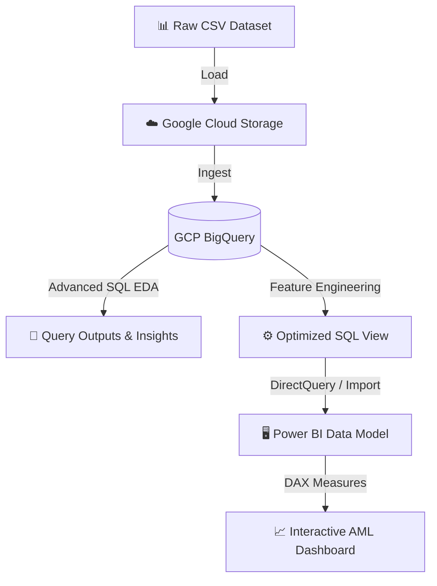
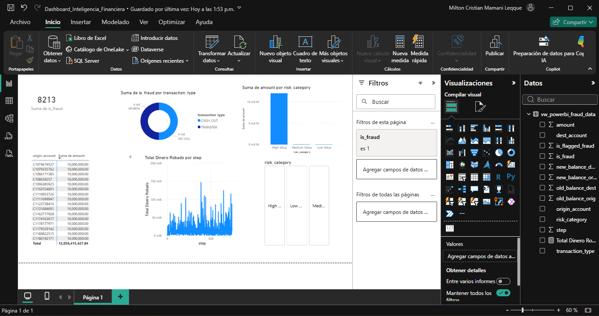
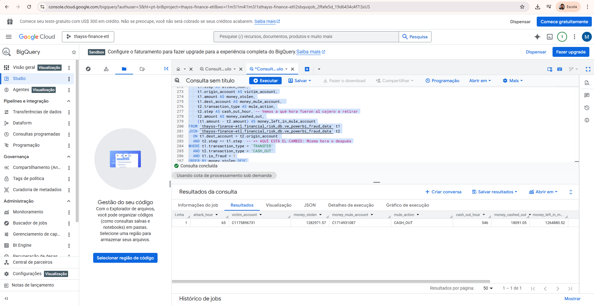

<div align="center">
  <br />
  <h1>☁️ Financial Fraud Analytics: Cloud SQL & Power BI Pipeline</h1>
  <p><strong>Forensic Data Engineering & Interactive Business Intelligence</strong></p>
  
  <p>
    <a href="#dashboard-preview" target="_blank">
      
    </a>
    <a href="https://github.com/thayss-tech" target="_blank">
      
    </a>
  </p>
  
  <p>
    <a href="https://cloud.google.com/bigquery" target="_blank">
      
    </a>
    <a href="https://en.wikipedia.org/wiki/SQL" target="_blank">
      
    </a>
    <a href="https://powerbi.microsoft.com/" target="_blank">
      
    </a>
  </p>
</div>

---

## 📑 Table of Contents

| Section | Description |
| :--- | :--- |
| [**💡 Overview**](#overview) | Project mission and business context. |
| [**📈 Business Impact**](#business-impact) | The real-world value: Catching money mules and Attack Windows. |
| [**🏗️ Architecture**](#architecture) | Technical flow from Cloud Data Warehouse to BI. |
| [**🔎 Analytical Strategy**](#analytical-strategy) | Forensic SQL techniques and BI design decisions. |
| [**⚙️ Technical Engine**](#technical-engine) | Breakdown of the analytics assets. |
| [**🗺️ Repository Map**](#repository-map) | Directory tree visualization. |
| [**🎮 How to Navigate**](#how-to-navigate) | A quick guide to the Dashboard features. |
| [**📸 Dashboard Preview**](#dashboard-preview) | Visual evidence of the final product. |
| [**📩 Contact**](#contact) | Professional links. |

---

## <a id="overview"></a>💡 Overview

While predictive machine learning focuses on stopping future fraud, **forensic data analytics** is essential for understanding *how* criminal networks operate in the present. 

This project establishes a Cloud Data Analytics pipeline to dissect a highly imbalanced financial dataset (where frauds represent < 1% of transactions). Using **Google BigQuery**, raw logs are transformed into actionable intelligence through Advanced SQL. This curated data is then consumed by **Power BI** to deliver a dynamic, interactive dashboard designed for Anti-Money Laundering (AML) and Cybersecurity teams.

🔗 **Complementary Analysis:** This project is directly connected to my second repository featuring an [End-to-End Predictive ML Pipeline](https://github.com/thayss-tech). **Both projects utilize the exact same dataset**, but their analyses are strictly complementary. While this repository focuses on macro-level forensic tracking and Business Intelligence, the ML project tackles real-time, micro-level transaction screening. The Exploratory Data Analysis (EDA) conducted with Python in the other repository strongly validates the SQL findings presented here.

> 📥 **Dataset Access for Reproduction:** Due to its massive size, the raw `.csv` is not hosted directly in this repository. If you want to clone this project and reproduce the SQL scripts, **[download the original dataset from Kaggle here](https://www.kaggle.com/datasets/amanalisiddiqui/fraud-detection-dataset?resource=download)** and upload it to your GCP BigQuery instance.

> 🤖 **Looking for the Predictive ML Model?**
> This repository focuses on **Data Engineering and Business Intelligence**. The machine learning phase of this exact dataset (Data Leakage prevention, Imbalance handling, and Scikit-Learn pipelines) is hosted in a separate repository on my profile!

---

## <a id="business-impact"></a>📈 Business Impact

By querying the database with a forensic mindset, this pipeline uncovered critical blind spots in standard fraud-detection rules:

* **The 50/50 Fraud Split:** While traditional literature flags wire transfers as the highest risk, the BI dashboard visually proved that the *actual volume* of successful attacks is split exactly 50/50 between `TRANSFER` and `CASH_OUT` operations. *(Note: In our companion ML project, the Python-based EDA also found this exact same result, which is why the predictive Scikit-Learn pipeline was strategically filtered to only evaluate these two high-risk categories).*
* **Money Mule Networks Exposed:** Using SQL Self-Joins, the pipeline successfully traced the "Transfer & Cash Out" pattern, identifying the exact bridge accounts (Money Mules) that receive stolen funds and withdraw them at ATMs within the same operational hour.
* **Coordinated Burst Attacks (744-Hour Timeline):** Tracking the transactions over a continuous 744-hour (31-day) simulation revealed that fraud does not follow typical human day/night cycles; it occurs relentlessly 24/7. The dashboard exposed severe, coordinated "burst attacks" at specific intervals (e.g., around step 400), where the capital hemorrhage spiked to nearly **$150 Million** in a single hour. This proves the institution is facing automated bot scripts and organized criminal syndicates, necessitating real-time machine learning firewalls rather than manual reviews.
* **The "Step" Variable Dichotomy (ML vs. BI):** In my predictive Machine Learning pipeline (hosted in a separate repository), the `step` (time) variable was deliberately dropped during Feature Engineering. Because fraud occurs relentlessly 24/7, keeping it would introduce noise and risk model overfitting. However, in this **Forensic BI pipeline**, `step` is actively utilized. By stepping back and aggregating the data chronologically, we shift from individual predictions to macro-level analysis, successfully visualizing the massive "burst attack" anomalies that the ML model is ultimately designed to block.

---

## <a id="architecture"></a>🏗️ Architectural Model

The system is designed as an End-to-End Analytics pipeline, moving from raw storage to C-level visualization.

### Operational Flow



#### Engineering Principles

* **☁️ Cloud Computing (GCP):** BigQuery was utilized to handle the millions of rows with high-performance execution, bypassing local hardware limitations.
* **🧠 Advanced SQL Capabilities:** The analysis relies heavily on Window Functions (`OVER`, `PARTITION BY`, `NTILE`), Common Table Expressions (`WITH`), and temporal logic (`MOD`) to calculate running totals and identify statistical anomalies (e.g., transactions 10x larger than the average for their type).
* **🧹 BI Optimization:** Instead of loading raw data into Power BI, a highly optimized `VIEW` was created in BigQuery, featuring pre-calculated risk categories (High, Medium, Low Value) to ensure lightning-fast dashboard rendering.

---

## <a id="analytical-strategy"></a>🔎 Analytical Strategy

To extract signal from the noise of millions of legitimate transactions, the pipeline employs specific forensic techniques:

* **Account Draining Detection:** Using CTEs, the SQL script isolates accounts where the transfer amount represents >98% of the original balance, a strong indicator of an account takeover. *(As discovered during the Python EDA in our companion ML project, relying on simple human-coded rules like 'balance drops to zero' accidentally flags over 1.2 million legitimate users. This advanced BI tracking provides the necessary macro-context to support the ML's multivariate approach).*
* **The Self-Join Tracking:** To detect laundering, the script joins the transaction table onto itself (`t1.dest_account = t2.origin_account`), effectively tracking the flow of money from a victim's account to a mule, and finally to physical cash.
* **DAX Dynamics:** In Power BI, explicit DAX measures were created to accurately format and calculate monetary losses dynamically based on user-selected cross-filters.

---

## <a id="technical-engine"></a>⚙️ Technical Engine: Production Assets

| Subsystem | Icon | Component | Purpose |
| :--- | :---: | :--- | :--- |
| **Cloud Transformation** | 🗄️ | `01_analisis_fraude.sql` | The master SQL script containing all CTEs, Window Functions, and Network tracking queries. |
| **Forensic Evidence** | 📄 | `output_red_lavado_mulas.csv` | Extracted BigQuery results proving the existence of the Money Mule network. |
| **BI Engine** | 📊 | `Dashboard_Inteligencia.pbix` | The native Power BI file containing the data model, DAX measures, and UI design. |


> ⚠️ **Technical Note on the Power BI File (.pbit)** > To comply with GitHub's repository limits and cloud security best practices, the dashboard is provided as a **Power BI Template (`.pbit`)** rather than a standard `.pbix`.  
> * **What this means:** The template preserves all my DAX measures, the relational data model, and the UI/UX design, but is completely stripped of the millions of rows of raw data.  
> * **Data Access:** Because the original file connects via DirectQuery/Import to a private, authenticated Google BigQuery environment, external users will not be able to refresh the data. However, recruiters and technical reviewers can still open the `.pbit` file in Power BI Desktop to inspect the underlying DAX code, the architectural structure, and the visual configuration.  
> * **Reconstruction:** If you wish to rebuild the pipeline locally, download the [raw dataset from Kaggle](https://www.kaggle.com/datasets/amanalisiddiqui/fraud-detection-dataset?resource=download), run the provided SQL scripts, and reconnect the data source.

---

## <a id="repository-map"></a>🗺️ Repository Map

```text
GCP_PowerBI_Fraud_Analytics/
 ┃
 ┣ 📂 sql_scripts/
 ┃ ┣ 📄 01_analisis_fraude.sql                  # BigQuery EDA and Feature Engineering script
 ┃ ┣ 📄 output_top5_cuentas.csv                 # Query result: Top offending accounts
 ┃ ┣ 📄 output_red_lavado_mulas.csv             # Query result: Tracked money mule paths
 ┃ ┗ 🖼️ gcp_money_mules_query.png               # Screenshot of BigQuery execution console
 ┃
 ┣ 📂 dashboards/
 ┃ ┣ 📦 Dashboard_Inteligencia_Financiera.pbit  # Power BI Template (Stripped of data for GitHub limits)
 ┃ ┣ 🖼️ dashboard_vista_principal.png           # Main Dashboard UI Screenshot
 ┃ ┗ 🖼️ dashboard_filtrado_high_value.png       # Filtered Dashboard UI Screenshot
 ┃
 ┗ 📄 README.md                                 # Technical and business documentation (this file)
```

---

## <a id="how-to-navigate"></a>🎮 How to Navigate the Dashboard

The Power BI Dashboard is designed to be highly interactive. If you download the `.pbix` file, here is how you can use it:

1. **Risk Segmentation (Top Left):** Use the modern button slicers to instantly filter the entire canvas. Clicking "High Value" will isolate operations exceeding $100,000.
2. **Temporal Electrocardiogram (Bottom Left):** The line chart displays the "Capital Hemorrhage". Hover over the aggressive spikes to identify the exact step (hour) the attack took place.
3. **The Blacklist Matrix (Right):** This table acts as a target list for AML teams. Selecting a specific Account ID will cross-filter the donut chart to reveal exactly how that specific criminal extracted the funds.

---

## <a id="dashboard-preview"></a>📸 Dashboard Preview


**Main View (Cybersecurity Dark Mode)**


**Google BigQuery Execution**


---

## <a id="contact"></a>📩 Contact

<div align="center">

| Platform | Profile | Action |
| :--- | :--- | :--- |
| **LinkedIn** | Milton Mamani | [View Profile](https://www.linkedin.com/in/milton-mamani-1369a537b) |
| **GitHub** | thayss-tech | [Explore Repos](https://github.com/thayss-tech) |

<br />

> *Transforming raw data into strategic business intelligence and forensic evidence.*

</div>
